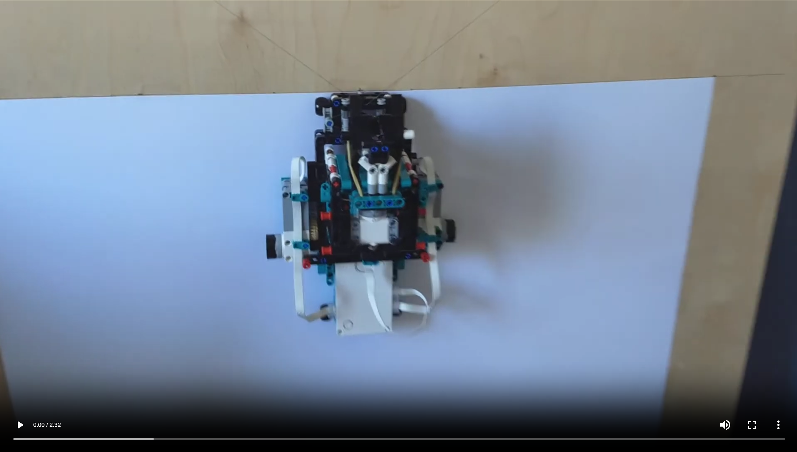
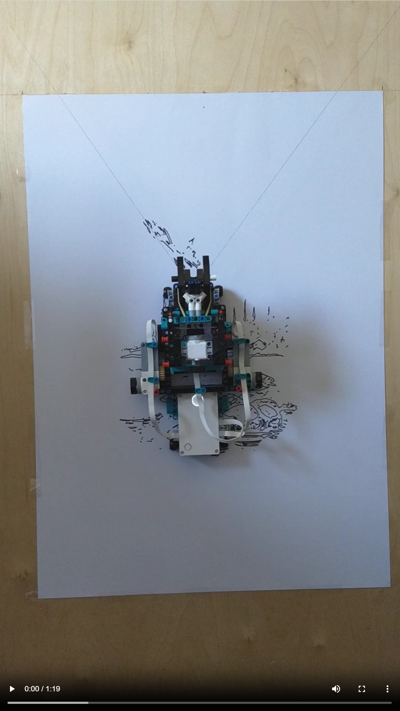
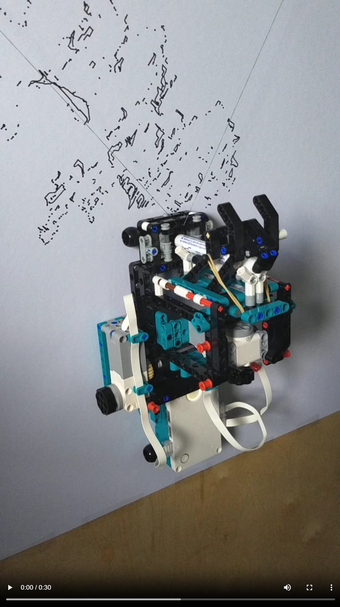

# Doodlebot: A Lego Wall Plotter

(Also see my blogpost [**here**](https://www.berryvansomeren.com/posts/doodlebot))

By chance, I came across [this lego wall plotter by Marco Schulte](https://voot.de/projects/lego-wallplotter/).
It reminded me of the Lego Mindstorms project which was my first encounter with programming, 
and I really wanted to recreate this awesome project. 

I did not want to copy the original code, and also thought I could perhaps taylor it a bit more to my own desired workflow.
So, I quickly made a much simpler version of the code using only Lego Mindstorms standard functions. 
It worked by deciding for every piece of linear path, which motor had to run at max speed, how the speed of the other motor had to be scaled relatively, and for how long both motors had to run. 
However, I found out that when going up against gravity, the robot would undershoot targets, and when going down with gravity, the robot would overshoot targets. 
Then, I finally understood why Marco Schulte's code had this feedback loop that keeps checking the progress towards a target, and adjusts accordingly. 
I also found out that some of the functions that were used in the original code were undocumented in the mindstorms library. 
I was able to find more information about those functions [thanks to Anton's Mindstorms](https://www.antonsmindstorms.com/2021/01/14/advanced-undocumented-python-in-spike-prime-and-mindstorms-hubs/).

I then rewrote the entire thing in a way that minimized the amount of code on the device, and maximized precomputation of plotter instructions and creation of previews. 
This created in a workflow that allowed me to quickly catch any errors in normal modern python, before I even had to mess with micropython and lego mindstorms. 
I did not really change anything in the design of the lego construction of the robot. 
I only added a few pieces to make the frame just a tad more robust. Really, Marco Schulte's design for the plotter is absolutely perfect! 

## Images

    
    
    

## Videos

    
    
    

